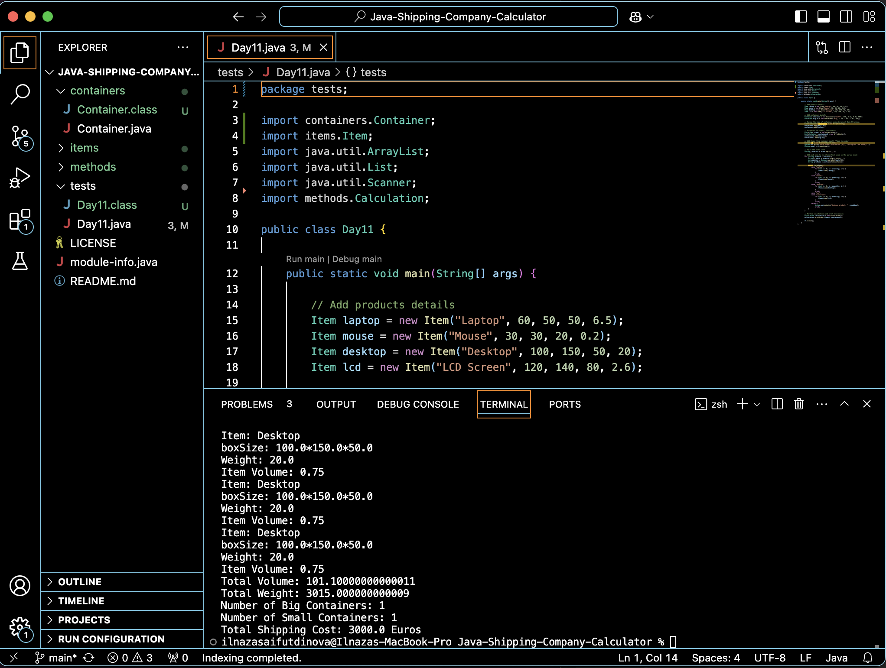

# 🚢 Java Shipping Company Calculator

## 📦 Overview
This is a backend shipping cost calculator for transporting various tech products from **China to Germany in regular bases**. It calculates the **best shipping method** using containers based on **volume and weight**, fully written in **Java** with OOP principles.

> ✅ Summer 2024  
> 🧠 Implemented with Object-Oriented Programming Practices such as Encapsulation, Abstraction, Inheritance, and Packages

---

## 🎯 What It Does
- Allows user to enter a custom product order (e.g., `150 Laptop, 200 Mouse`)
- Calculates total **volume** and **weight**
- Selects the **most cost-effective combination** of small and big containers
- Returns total shipping cost and container usage

## 🛠️ Technologies Used

- ☕ **Java 17**
- 🧱 **Object-Oriented Programming**: Abstraction, Inheritance, Encapsulation
- 📦 **Modular Project Structure** with packages (`items`, `containers`, `methods`)
- 🎛️ **Scanner for CLI Input** (user-friendly console interface)
- 🌐 **UTF-8 Encoding**

---

## 📂 Project Structure
- containers
  - Container.java
- items
  - Item.java
- methods
  - Calculation.java
- tests
  - Day11.java
- LICENSE
- README.md
- module-info.java

## 🔄 Clone the Repository

You can clone this repository using **HTTPS** or **SSH**:

### 🔗 Clone via HTTPS:
```bash
git clone https://github.com/ilnazasaifutdinova/Java-Shipping-Company-Calculator.git
```


### 🔗 Clone via SSH:
```bash
git clone git@github.com:ilnazasaifutdinova/Java-Shipping-Company-Calculator.git
```

## 🚀 How to Compile & Run

After cloning the repository, you can run the project from your terminal:

```bash
# 1️⃣ Navigate into the project folder
cd Java-Shipping-Company-Calculator

# 2️⃣ Compile the main Java file
javac Test/Day11.java

# 3️⃣ Run the compiled program
java Test.Day11
```

## 💡 Example Output



**Order Summary:**

- 📦 Total Volume: `101.1 m³`
- ⚖️ Total Weight: `3015.0 kg`
- 🚚 Containers Used:
  - 1 × Big Container
  - 1 × Small Container
- 💶 Total Shipping Cost: `3000.0 Euros`
